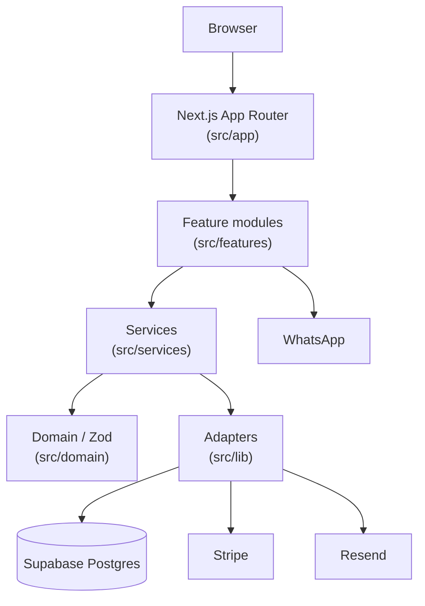

# 00 — Project Overview

> Read-only discovery. Evidence from repository files as of this audit. No application code was modified.

## Purpose

**Maison Fondjo** (`fondjoracine-website`) is the production marketing and commerce website for [fondjoracine.com](https://fondjoracine.com). It sells a single product: **Sève Racine**, a botanical hair treatment oil.

The live public conversion path is **WhatsApp-assisted ordering**, backed by a Next.js App Router storefront, optional Supabase CMS content, and an admin command center. Structured checkout (MoMo / Stripe), DB-backed hair consultations, and multi-product commerce APIs exist in code but are partially unmounted or redirected.

## Business Domain

| Aspect        | Description                                                                           |
| ------------- | ------------------------------------------------------------------------------------- |
| Brand         | Maison Fondjo                                                                         |
| Product       | Sève Racine (hair treatment oil / elixir)                                             |
| Market        | Primarily Cameroon (MTN MoMo, Orange Money, WhatsApp) with bilingual EN/FR storefront |
| Model         | One-product premium DTC storefront + advisor funnel + manual payment verification     |
| Claims policy | Product safety copy avoids medical/cure/disease/regrowth claims (`README.md`)         |

## Primary Users

| Persona                | How they use the system                                                                                                                 |
| ---------------------- | --------------------------------------------------------------------------------------------------------------------------------------- |
| **Shoppers**           | Browse `/` or `/fr`, advisor pages; order via WhatsApp CTAs                                                                             |
| **Wholesale / trade**  | Visit `/grossistes`                                                                                                                     |
| **Diagnostic seekers** | Complete quiz on `/diagnostic` → WhatsApp handoff                                                                                       |
| **Admins**             | Access `/admin` and `/admin/orders` with Supabase Auth + role permissions (CMS, orders, MoMo verification, Inner Circle, consultations) |

There is **no in-app login UI** for customers or admins in this repository (`signIn` / `signUp` / `signOut` are not used in `src/`). Admin access assumes an existing Supabase Auth cookie session.

## Technology Stack

| Layer       | Technology                                             | Evidence                                    |
| ----------- | ------------------------------------------------------ | ------------------------------------------- |
| Framework   | Next.js **16.2.9** (App Router)                        | `package.json`                              |
| UI          | React **19.2.4**, Tailwind CSS **4**, Radix UI, Lucide | `package.json`, `src/components/ui/`        |
| Language    | TypeScript 5 (strict)                                  | `tsconfig.json`                             |
| Validation  | Zod 4, React Hook Form (selective)                     | `package.json`, domain schemas              |
| Motion / 3D | Framer Motion, Lenis, Three.js + R3F                   | `package.json`, `src/components/three/`     |
| Data        | Supabase (`@supabase/ssr`, `@supabase/supabase-js`)    | `src/lib/supabase/`, `supabase/migrations/` |
| Payments    | Stripe (optional), manual MTN/Orange MoMo              | env, `one-product-order-service`            |
| Email       | Resend                                                 | `src/lib/email/`, env                       |
| Media       | Cloudinary (optional; client exists, little usage)     | `src/lib/cloudinary/`, `.env.example`       |
| Deploy      | Vercel                                                 | `vercel.json`, `README.md`                  |

## Deployment Platform

- **Vercel** with framework preset `nextjs` (`vercel.json`)
- Domain documented as **fondjoracine.com** (`README.md`, `.env.example`)
- Build: `npm run build` (runs `prebuild` → `scripts/diagnose.mjs`)

## External Integrations

| Integration                 | Role                                         | Status in repo                                              |
| --------------------------- | -------------------------------------------- | ----------------------------------------------------------- |
| **Supabase**                | Auth cookies, Postgres, RLS, CMS, orders     | Core                                                        |
| **WhatsApp**                | Primary sales + diagnostic handoff (`wa.me`) | Core / live                                                 |
| **MTN MoMo / Orange Money** | Manual payment numbers + admin verify        | Backend ready; structured UI form not mounted on live pages |
| **Resend**                  | Admin order notification emails              | When API key set                                            |
| **Stripe**                  | Checkout session + webhook                   | Optional; gated; checkout UI not mounted                    |
| **Cloudinary**              | Remote image host allowed in Next config     | Adapter present; not called from feature flows found        |

## Project Maturity

| Signal            | Observation                                                                                                                                                                                         |
| ----------------- | --------------------------------------------------------------------------------------------------------------------------------------------------------------------------------------------------- |
| Production intent | Site/domain docs, security headers, Husky pre-commit, `verify` script                                                                                                                               |
| Architecture      | Documented layered design (`docs/ARCHITECTURE.md`)                                                                                                                                                  |
| Schema            | Full ecommerce schema + one-product extensions (9 migrations)                                                                                                                                       |
| Product focus     | Multi-product routes redirect to one-product advisor/storefront                                                                                                                                     |
| Gaps              | Orphaned UI (order flow, newsletter form, hair consultation agent); unused browser Supabase client; stub DB TypeScript types; no `middleware.ts`; README route list partially outdated vs redirects |

**Maturity assessment:** Production-oriented one-product brand site with a mature backend surface and a simpler live frontend conversion path (WhatsApp). Several commerce/checkout features are implemented but not fully wired into the current UI.

## High-Level Architecture

## Related Existing Docs

- `README.md` — setup, env, key routes
- `docs/ARCHITECTURE.md` — layer rules
- `public/images/README.md` — image slots
