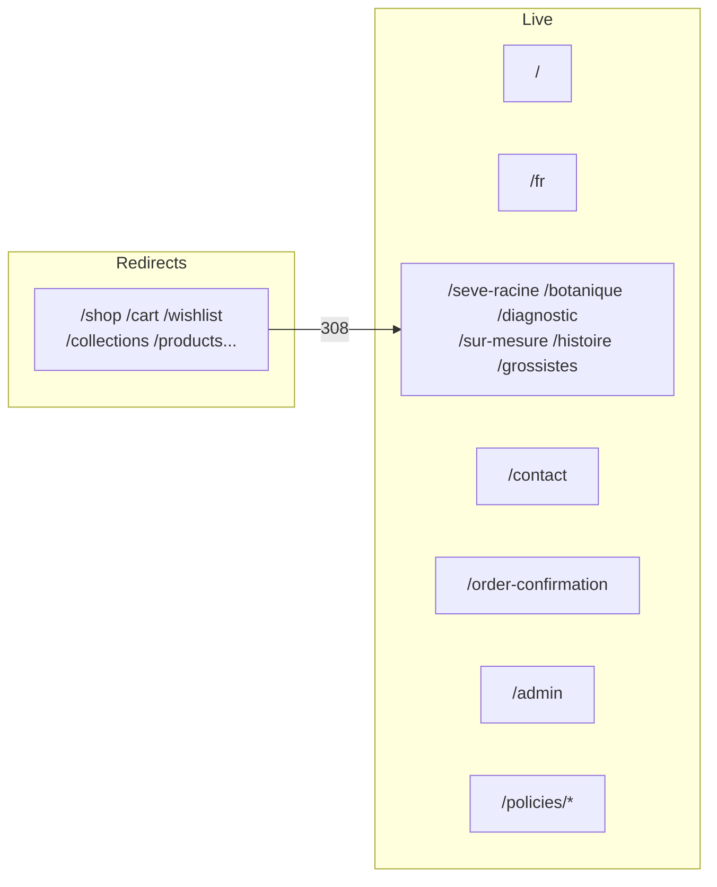

# 02 — Routing

App Router root: `src/app/`. Single root layout. **No** nested layouts, **no** `loading.tsx`, **no** `middleware.ts`.

Global files:

| File                    | Role                                                                   |
| ----------------------- | ---------------------------------------------------------------------- |
| `src/app/layout.tsx`    | Root layout: Fraunces font, org JSON-LD, `AppProviders`                |
| `src/app/error.tsx`     | Client error boundary → `ErrorState`                                   |
| `src/app/not-found.tsx` | 404 → `EmptyState`                                                     |
| `src/app/sitemap.ts`    | `/sitemap.xml`                                                         |
| `src/app/robots.ts`     | `/robots.txt` (blocks `/admin`, `/api`, `/order-confirmation` in prod) |
| `src/app/manifest.ts`   | PWA manifest                                                           |

Redirects are defined both in `page.tsx` files and permanently in `next.config.ts`.

---

## Active marketing / commerce pages

| URL                   | Page file                             | Layout | Loading | Error       | Metadata                               | Auth                       | Data source                                     | Purpose                           |
| --------------------- | ------------------------------------- | ------ | ------- | ----------- | -------------------------------------- | -------------------------- | ----------------------------------------------- | --------------------------------- |
| `/`                   | `src/app/page.tsx`                    | Root   | none    | `error.tsx` | `generateMetadata()` CMS SEO + JSON-LD | Public                     | CMS `storefront_content` via `getElixirContent` | EN premium storefront             |
| `/fr`                 | `src/app/fr/page.tsx`                 | Root   | none    | global      | FR SEO metadata                        | Public                     | Same CMS path                                   | FR premium storefront             |
| `/faq`                | `src/app/faq/page.tsx`                | Root   | none    | global      | `buildRouteMetadata`                   | Public                     | `LandingRoutePage` / CMS                        | Landing pattern (full storefront) |
| `/how-to-use`         | `src/app/how-to-use/page.tsx`         | Root   | none    | global      | route metadata                         | Public                     | LandingRoutePage                                | Landing pattern                   |
| `/origin-story`       | `src/app/origin-story/page.tsx`       | Root   | none    | global      | route metadata                         | Public                     | LandingRoutePage                                | Landing pattern                   |
| `/contact`            | `src/app/contact/page.tsx`            | Root   | none    | global      | static + OG                            | Public                     | Config / copy                                   | Contact cards (WA, email, terms)  |
| `/order-confirmation` | `src/app/order-confirmation/page.tsx` | Root   | none    | global      | noindex; `force-dynamic`               | **Token gate** (`?token=`) | Admin Supabase client → orders                  | Order status / MoMo instructions  |
| `/seve-racine`        | `src/app/seve-racine/page.tsx`        | Root   | none    | global      | advisor metadata                       | Public                     | Static advisor copy                             | Product advisor section           |
| `/botanique`          | `src/app/botanique/page.tsx`          | Root   | none    | global      | advisor metadata                       | Public                     | Static                                          | Ingredients / botanicals          |
| `/diagnostic`         | `src/app/diagnostic/page.tsx`         | Root   | none    | global      | advisor metadata                       | Public                     | Client quiz only                                | Hair diagnostic → WhatsApp        |
| `/sur-mesure`         | `src/app/sur-mesure/page.tsx`         | Root   | none    | global      | advisor metadata                       | Public                     | Static                                          | Bespoke care                      |
| `/histoire`           | `src/app/histoire/page.tsx`           | Root   | none    | global      | advisor metadata                       | Public                     | Static                                          | Brand story                       |
| `/grossistes`         | `src/app/grossistes/page.tsx`         | Root   | none    | global      | advisor metadata                       | Public                     | Static                                          | Wholesale                         |
| `/policies/terms`     | `src/app/policies/terms/page.tsx`     | Root   | none    | global      | yes + OG                               | Public                     | `publicCopy`                                    | Terms                             |
| `/policies/privacy`   | `src/app/policies/privacy/page.tsx`   | Root   | none    | global      | yes + OG                               | Public                     | copy                                            | Privacy                           |
| `/policies/shipping`  | `src/app/policies/shipping/page.tsx`  | Root   | none    | global      | yes + OG                               | Public                     | copy                                            | Shipping                          |
| `/policies/returns`   | `src/app/policies/returns/page.tsx`   | Root   | none    | global      | yes + OG                               | Public                     | copy                                            | Returns                           |

Advisor pages wrap content in `AdvisorShell` (client shell used from server pages).

---

## Admin pages

| URL             | Page file                       | Auth                                                             | Data                    | Purpose                    |
| --------------- | ------------------------------- | ---------------------------------------------------------------- | ----------------------- | -------------------------- |
| `/admin`        | `src/app/admin/page.tsx`        | `requireAdminPermission(analyticsRead)`; else `AdminLockedState` | `getAdminDashboardData` | Command center             |
| `/admin/orders` | `src/app/admin/orders/page.tsx` | `requireAdminPermission(ordersRead)`                             | Orders via services     | Orders / MoMo verification |

Both: `dynamic = force-dynamic`, `robots: noindex`.

---

## Redirect-only pages

| URL                   | File                                  | Destination    |
| --------------------- | ------------------------------------- | -------------- |
| `/cart`               | `src/app/cart/page.tsx`               | `/seve-racine` |
| `/shop`               | `src/app/shop/page.tsx`               | `/seve-racine` |
| `/collections`        | `src/app/collections/page.tsx`        | `/seve-racine` |
| `/collections/[slug]` | `src/app/collections/[slug]/page.tsx` | `/seve-racine` |
| `/product`            | `src/app/product/page.tsx`            | `/seve-racine` |
| `/products/[slug]`    | `src/app/products/[slug]/page.tsx`    | `/seve-racine` |
| `/search`             | `src/app/search/page.tsx`             | `/seve-racine` |
| `/wishlist`           | `src/app/wishlist/page.tsx`           | `/seve-racine` |
| `/pre-order`          | `src/app/pre-order/page.tsx`          | `/seve-racine` |
| `/hair-consultation`  | `src/app/hair-consultation/page.tsx`  | `/diagnostic`  |
| `/ingredients`        | `src/app/ingredients/page.tsx`        | `/botanique`   |

Mirrored as permanent redirects in `next.config.ts`.

---

## Route map diagram

## Counts

| Category                          | Count |
| --------------------------------- | ----: |
| `page.tsx`                        |    32 |
| Active public UI routes (approx.) |   ~18 |
| Redirect-only                     |    11 |
| Admin                             |     2 |
| `loading.tsx`                     |     0 |
| Nested layouts                    |     0 |
| Middleware                        |     0 |
