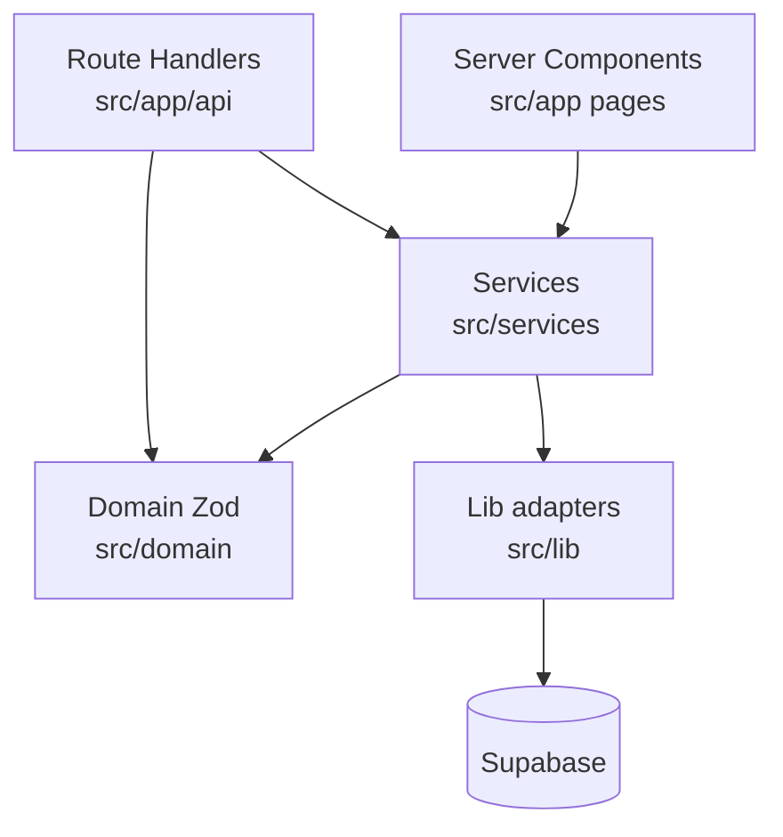

# 04 — Backend Architecture

## Overview

Backend work happens inside the **Next.js server runtime**:

1. **Route Handlers** under `src/app/api/**/route.ts`
2. **Server Components** that call services directly (admin, CMS read, order confirmation)
3. **Service layer** under `src/services/`
4. **Lib adapters** under `src/lib/` (Supabase, Stripe, Resend, rate limit, API helpers)

There are **no Server Actions** and **no separate Express/Nest backend**.

## Layer responsibilities

## Route Handlers (API)

See [09-api.md](./09-api.md) for the full inventory.

Categories:

| Category                 | Examples                                  | Auth                                    |
| ------------------------ | ----------------------------------------- | --------------------------------------- |
| Public commerce / health | products, collections, categories, health | Public                                  |
| Elixir one-product       | `/api/elixir/orders*`                     | Rate limit + token; service role DB     |
| Hair consultation        | `/api/hair-consultation*`                 | Rate limit; service role insert         |
| Newsletter               | `/api/newsletter`                         | Public insert via admin client          |
| User commerce            | cart, wishlist, orders, reviews           | `requireApiUser`                        |
| Admin                    | `/api/admin/*`                            | `requireAdminPermission`                |
| Webhooks                 | `/api/webhooks/stripe`                    | Stripe signature                        |
| Stub                     | `/api/checkout`                           | Always rejects; points to elixir orders |

## Service layer

| Path                                              | Responsibility                                                   |
| ------------------------------------------------- | ---------------------------------------------------------------- |
| `services/commerce/one-product-order-service.ts`  | Create/list/update one-product orders, MoMo refs, Stripe fulfill |
| `services/commerce/order-notification-service.ts` | Resend admin emails                                              |
| `services/commerce/hair-consultation-service.ts`  | Rules engine + persist consultations                             |
| `services/commerce/admin-dashboard-service.ts`    | CMS updates, stock, Inner Circle, dashboard aggregates           |
| `services/commerce/admin-service.ts`              | Analytics summary                                                |
| `services/commerce/catalog-service.ts`            | Products/collections/categories                                  |
| `services/commerce/cart-service.ts`               | Cart CRUD                                                        |
| `services/commerce/order-service.ts`              | Legacy authenticated orders                                      |
| `services/commerce/wishlist-service.ts`           | Wishlist                                                         |
| `services/commerce/review-service.ts`             | Reviews                                                          |
| `services/commerce/support-service.ts`            | Support tickets                                                  |
| `services/commerce/customer-service.ts`           | Customers                                                        |
| `services/auth/auth-service.ts`                   | Interface stub only                                              |
| `services/*/ *-repository.ts`                     | Older repository interfaces / stubs                              |

## Utility / infrastructure layer (`src/lib`)

| Area                    | Role                            |
| ----------------------- | ------------------------------- |
| `lib/supabase/*`        | Browser + cookie server clients |
| `lib/database/admin.ts` | Service-role client             |
| `lib/auth/*`            | Session + RBAC helpers          |
| `lib/api/*`             | JSON parse, response helpers    |
| `lib/payments/*`        | Stripe helpers                  |
| `lib/email/*`           | Resend                          |
| `lib/cloudinary/*`      | Cloudinary client getter        |
| `lib/security/*`        | Rate limiting                   |
| `lib/errors/*`          | `AppError`                      |
| `lib/logger/*`          | Logging                         |
| `lib/seo/*`             | Metadata / JSON-LD builders     |

## Business logic location

| Concern                   | Where it lives                                                          |
| ------------------------- | ----------------------------------------------------------------------- |
| Validation                | Zod schemas in `src/domain/commerce/schemas.ts` (+ content/env schemas) |
| Order lifecycle           | `one-product-order-service`                                             |
| Hair recommendation rules | `hair-consultation-service`                                             |
| CMS merge / defaults      | `features/elixir/lib/cms.ts` + `features/elixir/data/content.ts`        |
| Pricing / WhatsApp facts  | `src/lib/config.ts`, `src/config/product-pricing.ts`, CMS overrides     |
| Authorization             | `lib/auth/rbac.ts` + SQL `has_admin_permission`                         |

## Data access

- Pass a `SupabaseClient` into services; use PostgREST `.from().select/insert/update/upsert/delete`
- Nested selects for catalog embeds (variants, images)
- One RPC used in app code: `has_admin_permission`
- Service role used for guest order flow, newsletter, consultations, confirmation page
- Cookie user client used for authenticated commerce + admin after permission check
