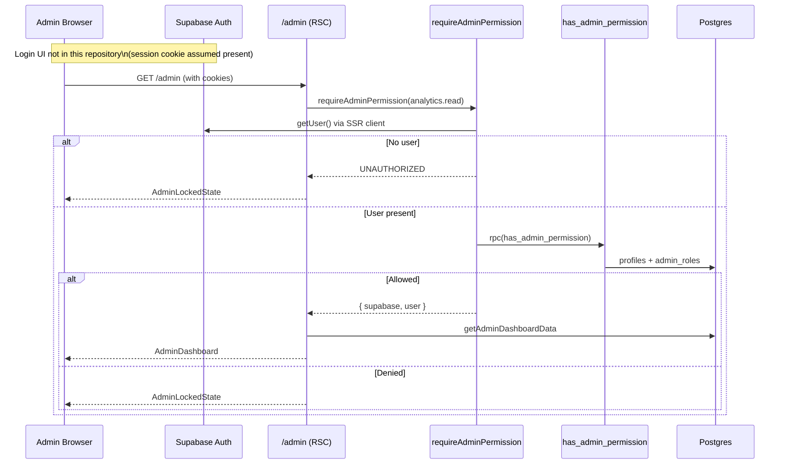

# 06 — Authentication

## Summary

Authentication is **Supabase Auth cookie sessions**, validated server-side with `getUser()`. There is **no login/signup UI** and **no Next.js middleware** in this repository. Authorization for admin uses SQL RPC `has_admin_permission`.

Customer-facing storefront is **public** (no login required for browsing or WhatsApp ordering).

## Session management

| Helper                   | File                      | Behavior                                     |
| ------------------------ | ------------------------- | -------------------------------------------- |
| `getCurrentUser`         | `src/lib/auth/session.ts` | Cookie server client → `auth.getUser()`      |
| `requireUser`            | same                      | Throws `AppError("UNAUTHORIZED")` if missing |
| `requireApiUser`         | `src/lib/auth/rbac.ts`    | Same for APIs; returns `{ supabase, user }`  |
| `requireAdminPermission` | `src/lib/auth/rbac.ts`    | `requireApiUser` + RPC permission check      |

Browser client exists but is unused for auth flows.

**Unknown from repo:** How admin users are provisioned in Supabase Auth UI / invites / dashboard. Seeded admin roles exist in SQL (`Owner`, `Commerce Manager`, `Support Specialist`), but the interactive login path is outside this codebase.

## Role management

- `profiles.role`: `customer` | `admin` (foundation migration)
- Fine-grained permissions via `admin_roles.permissions` (`text[]`, including `*`) and `admin_user_roles`
- App permission string constants in `src/lib/database/schema.ts` (`adminPermissions`)
- SQL: `is_admin(user_id)`, `has_admin_permission(permission, user_id)`

## Middleware

**None.** No `middleware.ts` for session refresh or route gating.

Implication (observation only): cookie refresh / early redirects are not centralized at the edge; protection is per page/handler.

## Protected routes

| Surface                                         | Mechanism                                                                             |
| ----------------------------------------------- | ------------------------------------------------------------------------------------- |
| `/admin`, `/admin/orders`                       | Server Component `requireAdminPermission(...).catch(() => null)` → `AdminLockedState` |
| `/api/admin/*`                                  | `requireAdminPermission`                                                              |
| `/api/cart`, `/wishlist`, `/orders`, `/reviews` | `requireApiUser`                                                                      |
| `/order-confirmation`                           | Opaque `confirmation_token` query param (not user auth)                               |
| Elixir order APIs                               | Token + rate limits + service role writes                                             |

## Authorization checks

```18:26:src/lib/auth/rbac.ts
export async function requireAdminPermission(permission: string) {
  const { supabase, user } = await requireApiUser();
  const { data, error } = await supabase.rpc("has_admin_permission", { permission });
  // ...
}
```

Missing user → `UNAUTHORIZED`. Missing permission → `FORBIDDEN`.

## Login flow (as implemented in repo)

There is **no in-repo login flow**. Sequence below documents what the code expects once a session already exists.



## Customer auth

Legacy cart/wishlist/orders APIs require a logged-in Supabase user, but corresponding pages **redirect** to `/seve-racine`. No customer sign-in UI was found.

## Domain types

`src/domain/auth/types.ts` — `AuthRole`, `AuthSessionUser`.  
`src/services/auth/auth-service.ts` — interface stub (`getCurrentUser` only).
