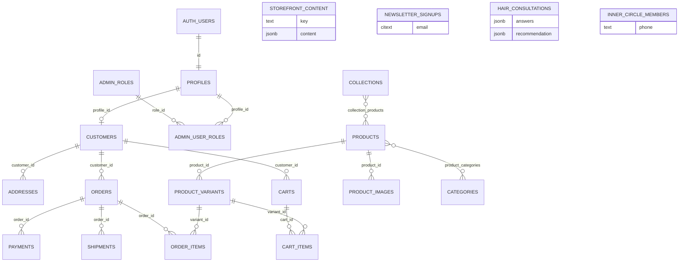

# 10 — Database

Source of truth: `supabase/migrations/000001`–`000009`. Column-level TypeScript types are **not** generated (`src/lib/database/schema.ts` stubs table names only).

---

## Tables inventory

### Identity & admin

| Table              | PK                      | Notable columns / FKs                                   |
| ------------------ | ----------------------- | ------------------------------------------------------- |
| `profiles`         | `id` → `auth.users`     | email, names, `role` customer\|admin, marketing_consent |
| `admin_roles`      | `id`                    | name unique, `permissions text[]`                       |
| `admin_user_roles` | `(profile_id, role_id)` | FKs profiles, admin_roles, granted_by                   |

### Customers

| Table       | PK   | FKs / notes                                                      |
| ----------- | ---- | ---------------------------------------------------------------- |
| `customers` | `id` | `profile_id` → profiles; self-referral FK; Stripe id; LTV fields |
| `addresses` | `id` | → customers                                                      |

### Catalog

| Table                 | Notes                            |
| --------------------- | -------------------------------- |
| `categories`          | self-FK `parent_id`; slug unique |
| `collections`         | slug unique; date window check   |
| `products`            | status enum; SEO; metadata jsonb |
| `product_variants`    | → products; SKU unique           |
| `product_images`      | → products, optional → variants  |
| `product_categories`  | composite PK                     |
| `collection_products` | composite PK + position          |

### Inventory

`inventory_locations`, `inventory_items` (unique variant+location), `inventory_movements`

### Promotions

`coupons` (citext code), `discounts` (optional product/collection FKs)

### Cart / orders / payments / shipping

| Table                         | Notes                                                                                                                                                       |
| ----------------------------- | ----------------------------------------------------------------------------------------------------------------------------------------------------------- |
| `carts`                       | customer XOR anonymous_id; optional coupon                                                                                                                  |
| `cart_items`                  | unique cart+variant                                                                                                                                         |
| `orders`                      | totals; customer; + one-product columns (000007): name, phone, city, address, payment_method, manual refs, `confirmation_token` unique, admin verify fields |
| `order_items`                 | → orders, variants                                                                                                                                          |
| `payments`                    | unique provider + provider_payment_id                                                                                                                       |
| `shipments`                   | → orders                                                                                                                                                    |
| `shipping_rates`, `tax_rates` | config                                                                                                                                                      |

### Engagement & ops

`reviews`, `wishlists`, `wishlist_items`, `analytics_events`, `referrals`, `subscriptions`, `subscription_items`, `audit_logs`, `notifications`, `support_tickets`, `support_ticket_messages`

### Later product features

| Table                  | Notes                                                        |
| ---------------------- | ------------------------------------------------------------ |
| `newsletter_signups`   | citext email unique                                          |
| `storefront_content`   | key unique; status; `content jsonb`                          |
| `inner_circle_members` | phone unique; status active\|paused\|cancelled               |
| `hair_consultations`   | answers/recommendation jsonb; risk_level; WA followup status |

---

## Enums (selected)

- `product_status`, `inventory_movement_type`, `discount_type`
- `order_status` — base ecommerce values **plus** `pending_payment`, `payment_submitted`, `confirmed`, `packed`, `shipped`, `delivered` (000007)
- `payment_status`, `fulfillment_status`, `review_status`, `subscription_status`, `ticket_status`, `notification_channel`, `storefront_content_status`

---

## Indexes (high level)

Declared on foreign keys and common filters: customers/profile, products status, variants, cart items, orders by customer/created/`confirmation_token`/status/payment_method, payments, reviews, wishlists, analytics, audit, notifications, tickets, storefront `(key, status)`, inner_circle, hair_consultations (created_at, risk, phone).

## Constraints

- Cart ownership XOR pattern
- Order total consistency checks (000002)
- Payment method check constraint for one-product flow
- Unique SKUs, slugs, confirmation tokens, coupon codes, Inner Circle phones

## Extensions

`pgcrypto`, `citext`

---

## ER-style relationship summary

Standalone lead/CMS tables (`storefront_content`, `newsletter_signups`, `hair_consultations`, `inner_circle_members`) have **no FKs** to `orders`/`customers` in migrations (operationally linked by phone/email in app logic).

---

## Helpers (security definer)

- `set_updated_at()` trigger helper
- `is_admin(user_id)`
- `has_admin_permission(permission, user_id)`
- `customer_owns` / `cart_owns` / `order_owns` for RLS

Seeded roles: Owner (`*`), Commerce Manager, Support Specialist.
