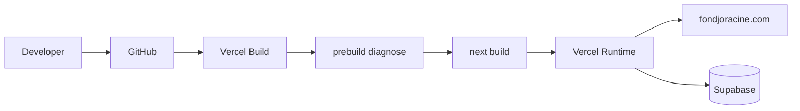

# 12 — Deployment

## Platform

**Vercel** + Next.js.

Config file `vercel.json`:

```json
{
  "$schema": "https://openapi.vercel.sh/vercel.json",
  "framework": "nextjs"
}
```

No custom build/output/rewrites beyond Next defaults in that file. Redirects and security headers live in `next.config.ts`.

## Build process

| Step               | Command / script                            | Notes                                            |
| ------------------ | ------------------------------------------- | ------------------------------------------------ |
| Install            | `npm install`                               | Documented in README                             |
| Prebuild           | `npm run diagnose` (`scripts/diagnose.mjs`) | Runs automatically via `prebuild` before `build` |
| Build              | `npm run build` → `next build`              |                                                  |
| Start (local prod) | `npm start` → `next start`                  |                                                  |
| Verify CI-like     | `npm run verify` → lint + typecheck + build |                                                  |

## Runtime

- Next.js Node server on Vercel serverless / Node runtime for Route Handlers and RSC.
- App Router with `force-dynamic` on admin and order-confirmation pages.
- Images: AVIF/WebP; remote Cloudinary host allowed.

## Environment variables

Set in Vercel project settings from `.env.example` (see [11-environment.md](./11-environment.md)).

## Domains

- Documented production domain: **fondjoracine.com** (`README.md`, `.env.example`)
- Exact DNS / preview domain mapping could not be fully determined from repo alone (configure in Vercel dashboard).

## Deployment workflow (documented)

From `README.md`:

1. Push repo to GitHub as `fondjoracine-website`
2. Import into Vercel
3. Framework preset Next.js
4. Add env vars
5. Deploy
6. Point `fondjoracine.com` to the project

GitHub Actions / CI workflows: **not found** in this audit (local Husky + `verify` script only). Absence of `.github/workflows` was consistent with exploration — if present elsewhere, re-check.

## Security headers (edge of Next config)

Applied to `/:path*`:

- `X-Content-Type-Options: nosniff`
- `X-Frame-Options: DENY`
- `Referrer-Policy: strict-origin-when-cross-origin`
- Restrictive `Permissions-Policy`
- CSP `frame-ancestors 'none'`

## robots / SEO deployment behavior

`src/app/robots.ts` blocks `/admin`, `/api`, `/order-confirmation` in production; staging behavior disallows all (implementation detail in that file).

## Diagram


