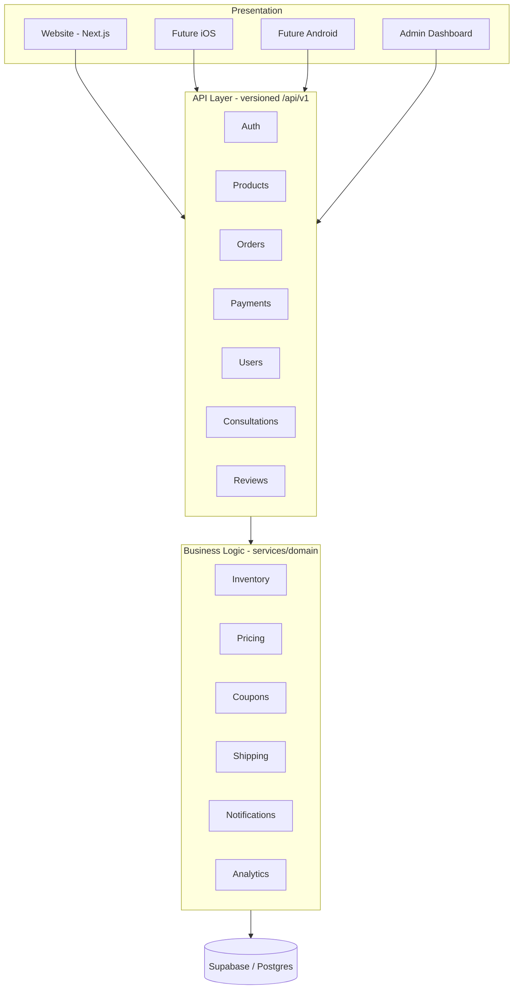
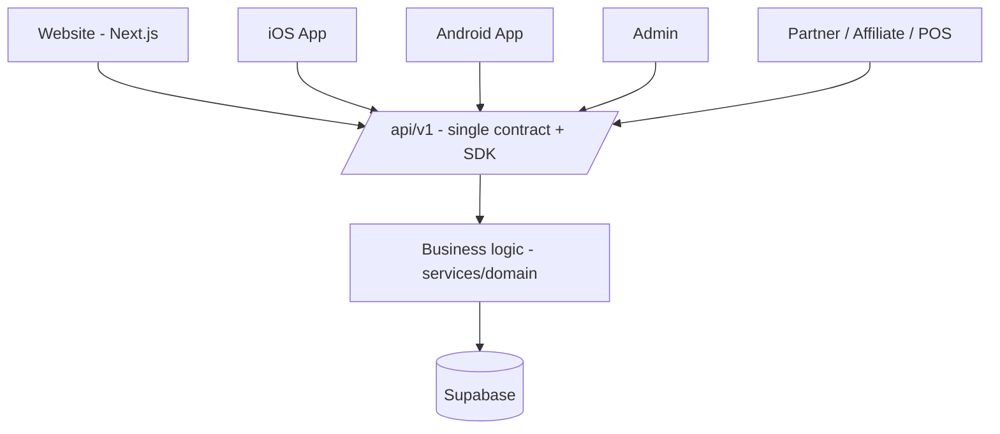

# PRD — Architecture & Codebase Future-Readiness

**Status:** Draft for approval
**Type:** Architecture / Platform evolution (incremental, non-breaking)
**Owner:** Platform / Architecture
**Companion doc:** [`PRD-gsap-animations.md`](./PRD-gsap-animations.md) (motion layer — separate scope)
**Grounding:** [`SUMMARY.md`](./SUMMARY.md) and the deep assessments of frontend & backend architecture.

---

## 1. Platform Vision

> **Maison Fondjo is a scalable, API-first, multi-platform commerce platform for botanical hair-care products, designed to serve customers globally through the web, iOS, Android, and future sales channels using a single backend.**

We are not building a one-product website. We are building a **brand platform** that can grow from Sève Racine to shampoo, conditioner, hair cream, beard oil, skin care, vitamins, subscription boxes, consultations, clinics, affiliates, specialists, and mobile apps — **without re-architecting.**

This document turns that vision into concrete, prioritized, **non-breaking** engineering work, based on what the codebase **already has** versus what must be **abstracted** or **added**.

---

## 2. Guiding Principles

1. **Build for the brand, not the product.** No hardcoding of "Sève Racine" in schema or business logic. (The DB already honors this — see §4.)
2. **API-first.** Every client (web, iOS, Android, admin) talks to the **same** versioned API. The website must not contain business logic or manipulate data directly.
3. **Separation of concerns — no mixed code.** Presentation, API, business logic, and data are distinct layers with one responsibility each. Business rules never live in React components or route handlers.
4. **Abstraction at every volatile boundary.** Payments, notifications, identity, currency, shipping — all behind interfaces so adding a provider/channel/method later is a config/plugin change, not a rewrite.
5. **Reuse before rebuild.** If a capability already exists (schema, service, endpoint), we **wire and expose** it — we do not duplicate it.
6. **Non-breaking, incremental.** No tech-stack swaps, no palette/typography changes, no route breakage. Everything ships behind additive migrations and backward-compatible endpoints.
7. **Parallelizable by 10+ developers.** Clear module ownership, stable contracts, and boundary enforcement so teams don't step on each other (see §6).

---

## 3. Target Layered Architecture



**Rule:** dependencies point downward only. Presentation never imports business logic; business logic never imports presentation; the API layer is the single public contract.

The repository **already reflects** this intent (`app → features → services → domain → lib`, per `docs/ARCHITECTURE.md`). This PRD hardens the boundaries and closes the gaps.

---

## 4. Current-State Capability Audit (reuse map)

**Legend:** ✅ Exists (reuse — do not rebuild) · 🟡 Partial (enhance/abstract) · 🔴 Missing (add)

### 4.1 What ALREADY EXISTS (reuse, do not re-add)

Evidence: `supabase/migrations/000002_ecommerce_backend.sql` unless noted.

| Vision pillar                             | Status | Evidence / notes                                                                                                                                                                                                                                     |
| ----------------------------------------- | :----: | ---------------------------------------------------------------------------------------------------------------------------------------------------------------------------------------------------------------------------------------------------- |
| **Generalized product model**             |   ✅   | `products` (has generic `brand`, `slug`, `metadata`; not hardcoded to Sève Racine), `product_variants`, `product_images`, `categories`, `collections`, `product_categories`, `collection_products`. **Adding product #2 = data entries, zero code.** |
| **Inventory**                             |   ✅   | `inventory_locations`, `inventory_items`, `inventory_movements`                                                                                                                                                                                      |
| **Pricing / coupons / discounts**         |   ✅   | `coupons`, `discounts`, `discount_type` enum                                                                                                                                                                                                         |
| **Cart (guest + customer)**               |   ✅   | `carts` (customer XOR `anonymous_id`, `currency`, `coupon_id`), `cart_items`                                                                                                                                                                         |
| **Generalized orders**                    |   ✅   | `orders` (`order_number`, `currency`, `shipping_address`/`billing_address` jsonb), `order_items`                                                                                                                                                     |
| **Provider-agnostic payments (storage)**  |   ✅   | `payments.provider` is free text (`stripe` default), `provider_payment_id`, `status`, `refunded_cents`. DB does not assume one provider.                                                                                                             |
| **Subscriptions / subscription boxes**    |   ✅   | `subscriptions` (`billing_interval` month/quarter/year), `subscription_items`                                                                                                                                                                        |
| **Reviews / wishlists**                   |   ✅   | `reviews` (verified purchase, moderation), `wishlists`, `wishlist_items`                                                                                                                                                                             |
| **Referrals / affiliate seed**            |   ✅   | `customers.referral_code`, `referred_by_customer_id`, `referrals` table                                                                                                                                                                              |
| **Event-based analytics**                 |   ✅   | `analytics_events` (`event_name`, `event_properties` jsonb, `anonymous_id`, `path`, `referrer`, `ip_hash`) — already event-first, not page-first                                                                                                     |
| **Notifications (multi-channel storage)** |   ✅   | `notifications` + `notification_channel` enum (`email`, `in_app`, `sms`)                                                                                                                                                                             |
| **Identity + RBAC**                       |   ✅   | `profiles.role`, `admin_roles`, `admin_user_roles`, `has_admin_permission()` RPC, seeded roles (Owner/Commerce Manager/Support Specialist)                                                                                                           |
| **Addresses with geo fields**             |   ✅   | `addresses` (`country_code`, `region`, `city`, `postal_code`)                                                                                                                                                                                        |
| **Multi-currency (storage)**              |   ✅   | `char(3)` `currency` on `product_variants`, `carts`, `orders`, `payments`                                                                                                                                                                            |
| **Shipping & tax by geography (basic)**   |   ✅   | `shipping_rates` (`country_code`, `region`), `shipments` (carrier/tracking), `tax_rates` (`country_code`, `region`, `rate_bps`)                                                                                                                      |
| **Support**                               |   ✅   | `support_tickets`, `support_ticket_messages`                                                                                                                                                                                                         |
| **Audit trail**                           |   ✅   | `audit_logs`                                                                                                                                                                                                                                         |
| **SEO foundation**                        |   ✅   | Dynamic metadata, Open Graph, Product/LocalBusiness/FAQ JSON-LD, `sitemap.ts`, `robots.ts`, `manifest.ts` (`src/app/*`, `src/lib/seo/*`)                                                                                                             |
| **Consultation capture**                  |   ✅   | `hair_consultations` + rules engine (`000009`, `hair-consultation-service.ts`)                                                                                                                                                                       |
| **Customer dashboard data**               |   ✅   | Tables for orders, addresses, wishlists, reviews, subscriptions, support all exist (UI missing — see 4.3)                                                                                                                                            |

> **Directive:** None of the above is to be recreated. Work items reference these by name and **extend** them.

### 4.2 What is PARTIAL (abstract / enhance in code — schema mostly ready)

| Pillar                          | Status | Gap                                                                                                                                                                                            |
| ------------------------------- | :----: | ---------------------------------------------------------------------------------------------------------------------------------------------------------------------------------------------- |
| **Payment abstraction (code)**  |   🟡   | DB is provider-agnostic, but `one-product-order-service.ts` branches on `stripe`/`mtn_momo`/`orange_money` inline. No `PaymentProvider` interface. Checkout knows the provider.                |
| **Notification service (code)** |   🟡   | `notifications` table exists but `order-notification-service.ts` calls Resend directly. No dispatcher abstraction; enum lacks `whatsapp`/`push`.                                               |
| **Identity system**             |   🟡   | Supabase Auth supports email/OAuth, but there is **no login/signup UI**, no social providers wired, no OTP/passkey. `getUser()`-only.                                                          |
| **Analytics emission**          |   🟡   | Event table exists; client does not emit the full taxonomy (View Product, Add to Cart, Checkout, etc.).                                                                                        |
| **i18n**                        |   🟡   | Dual content systems (dictionaries + CMS `LocalizedText`), locale from `localStorage`, no `[locale]` routing; `/fr` mismatches client locale.                                                  |
| **API-first discipline**        |   🟡   | API routes exist, but RSC/services are also called directly server-side; no `/v1` versioning; no shared client SDK; response envelope exists (`{ data } / { error }`) but not contract-tested. |
| **Type safety**                 |   🟡   | `lib/database/schema.ts` is a stub (`never` rows, missing tables); no generated Supabase types.                                                                                                |
| **Shipping model**              |   🟡   | Flat `shipping_rates` by country/region; no zones/methods/cities hierarchy the vision calls for.                                                                                               |
| **Currency display**            |   🟡   | Storage columns exist; no `currencies`/exchange-rate table, no display/formatting/conversion service.                                                                                          |

### 4.3 What is MISSING (add — genuinely new)

| Pillar                                         | Status | Add                                                                                                                                         |
| ---------------------------------------------- | :----: | ------------------------------------------------------------------------------------------------------------------------------------------- |
| **Generated DB types**                         |   🔴   | `supabase gen types` output wired as `SupabaseClient<Database>` everywhere                                                                  |
| **Payment provider registry**                  |   🔴   | `PaymentProvider` interface + registry (Stripe, MTN, Orange today; PayPal/Apple Pay/Google Pay/Flutterwave/CinetPay later)                  |
| **Notification dispatcher**                    |   🔴   | `NotificationChannel` interface + dispatcher; add `whatsapp`, `push` enum values (additive migration)                                       |
| **Currency service + tables**                  |   🔴   | `currencies` (code, symbol, exchange_rate, is_active), money formatting/conversion module                                                   |
| **Geographic shipping model**                  |   🔴   | `countries`, `regions`, `cities`, `shipping_zones`, `shipping_methods` (additive; existing `shipping_rates` kept/adapted)                   |
| **Locale routing**                             |   🔴   | `[locale]` segment (`/en`, `/fr`) with single content source; DB `locales` table optional                                                   |
| **Customer account UI + dashboard**            |   🔴   | Login/register + dashboard (Orders, Settings in v1; Addresses/Wishlist/Payment Methods/Hair Profile/Consultations/Reviews/Support as slots) |
| **API versioning + SDK**                       |   🔴   | `/api/v1/*` namespace, OpenAPI spec, generated TypeScript client shared by web + future mobile                                              |
| **Consultation → product recommendation link** |   🔴   | Map consultation output to `products`/`collections` (vision "Find the right treatment → Suggested Product → Buy")                           |
| **Module ownership + boundary enforcement**    |   🔴   | `CODEOWNERS`, module boundary lint rules, contribution guide (see §6)                                                                       |

---

## 5. Workstreams (each maps exists → target, non-breaking)

Each workstream is independently ownable and shippable. Format: **Reuse / Enhance / Add.**

### WS-1 · Identity System

- **Reuse:** `profiles`, `customers`, `admin_roles`, RBAC RPC, Supabase Auth.
- **Enhance:** introduce `IdentityService` so the app never calls `supabase.auth` directly from UI; the DB "doesn't care how someone logged in — one account per user."
- **Add:** login/register/reset UI; enable Google now; leave provider slots for Apple, Facebook, Phone/OTP, Passkeys. Customer session in API layer.
- **Non-breaking:** admin flows keep working; customer auth is additive.

### WS-2 · Payment Abstraction

- **Reuse:** `payments` table (`provider`, `provider_payment_id`, `status`, `currency`, `refunded_cents`), `payment_status` enum.
- **Enhance:** extract a `PaymentProvider` interface — `createIntent`, `confirm`, `refund`, `handleWebhook`. Move Stripe/MTN/Orange logic out of `one-product-order-service.ts` into provider modules behind a registry.
- **Add:** provider registry + config; slots for PayPal, Apple Pay, Google Pay, Flutterwave, CinetPay. Checkout only calls `PaymentService.process(order, method)` and never names a provider.
- **Non-breaking:** existing MoMo/WhatsApp/Stripe order paths keep working through the new interface.

### WS-3 · Product & Catalog (already generalized)

- **Reuse:** entire catalog schema. **No schema change needed to add products.**
- **Enhance:** finish `catalog-service` typing with generated types; ensure the storefront can render **any** product/collection, not a hardcoded Sève Racine page.
- **Add:** nothing structural. Optionally seed product #2 as a test of "zero-code product addition."

### WS-4 · Checkout & Order Flow

- **Reuse:** `carts`, `cart_items`, `orders`, `order_items`, `order-service`/`one-product-order-service`.
- **Enhance:** consolidate the two order pipelines (`FR-` one-product vs `LR-` legacy) into one order-creation path with pluggable payment; wrap multi-write creates (order + items + payment) in a Postgres function/transaction to avoid orphan rows.
- **Add:** shipment tracking surfacing + "leave review" loop already supported by `shipments`/`reviews`.

### WS-5 · Consultation → Recommendation

- **Reuse:** `hair_consultations`, rules engine, consultation questions (from brand reference).
- **Enhance:** map recommendation output to real `products`/`collections`.
- **Add:** "Find the right treatment" funnel wired to Buy, per vision (conversion driver).

### WS-6 · Customer Dashboard

- **Reuse:** orders/addresses/wishlist/reviews/subscriptions/support tables.
- **Add:** dashboard shell with sections present as slots even if v1 ships only **Orders + Settings** (leave room for Hair Profile, Payment Methods, Consultations).
- **Non-breaking:** net-new authenticated routes.

### WS-7 · Shipping & Geography

- **Reuse:** `shipping_rates`, `shipments`, `tax_rates`, `addresses.country_code/region/city`.
- **Add:** `countries`, `regions`, `cities`, `shipping_zones`, `shipping_methods` (additive migration). "Launching in France later won't require redesigning the DB."
- **Non-breaking:** keep `shipping_rates` working; migrate rate resolution to zones behind a `ShippingService`.

### WS-8 · Currency

- **Reuse:** `char(3)` currency columns everywhere.
- **Add:** `currencies` table (code, symbol, exchange_rate, is_active) + `MoneyService` (store canonical cents, convert/format for display). Cameroon/France/Canada/USA can all buy.
- **Non-breaking:** default currency behavior preserved.

### WS-9 · Languages / i18n

- **Reuse:** existing `en`/`fr` copy.
- **Enhance:** collapse dual content systems into **one** source of truth; adopt `[locale]` routing (`/en`, `/fr`) so server metadata and UI locale agree.
- **Add:** ability to add `es`/`de`/`ar` via data only, no DB redesign.

### WS-10 · Notification Service

- **Reuse:** `notifications` table + `notification_channel` enum.
- **Enhance:** `NotificationService.dispatch(event, recipient, channels)`; move Resend behind an `EmailChannel`.
- **Add:** `whatsapp` + `push` enum values (additive) and channel implementations. "Adding WhatsApp later is easy."

### WS-11 · Analytics

- **Reuse:** `analytics_events` (already event-based).
- **Enhance/Add:** client + server emit a standard event taxonomy — Viewed Product, Added/Removed Cart, Started Checkout, Payment Success/Failed, Signed Up, Logged In, Search, Review Submitted.

### WS-12 · SEO

- **Reuse:** strong existing metadata/JSON-LD/sitemap/robots/manifest.
- **Enhance:** make it **per-product/per-collection** so every catalog entry gets Open Graph, Twitter Card, structured data, canonical, sitemap inclusion — beautiful WhatsApp/Facebook shares.
- **Add:** minimal; mostly generalization.

### WS-13 · API-First & SDK

- **Enhance:** introduce `/api/v1/*`; enforce that the website consumes the API contract (no business logic in components/route handlers beyond orchestration).
- **Add:** OpenAPI spec + generated TypeScript client SDK reused by web and future mobile. Contract tests.
- **Non-breaking:** current routes can alias into `/v1` during transition.

### WS-14 · Type Safety

- **Add:** generated Supabase types; `SupabaseClient<Database>` on all clients; delete stub `schema.ts` table map. Catches column renames at compile time.

---

## 6. Separation of Concerns & Team Ownership (10+ developers)

### 6.1 Module boundaries (one responsibility each)

```
src/
  domain/<context>/        # pure types + Zod + rules (NO framework, NO db)
  services/<context>/      # business logic + data access (imports domain + lib)
  app/api/v1/<context>/    # thin HTTP handlers (imports services only)
  features/<feature>/      # UI for a feature (imports API client + components)
  components/ui/           # shared design system (no business logic)
  lib/<adapter>/           # infra adapters (supabase, payments, notify, money…)
```

**Bounded contexts (module owners can work in parallel):**
`identity` · `catalog` · `cart` · `orders` · `payments` · `shipping` · `pricing/promotions` · `inventory` · `reviews` · `consultations` · `notifications` · `analytics` · `content/cms` · `admin` · `storefront-ui` · `design-system` · `platform (api/sdk/types)`.

### 6.2 Rules that prevent collisions

1. **Contracts are the boundary.** Teams integrate through the API/SDK and domain types, not by reaching into each other's internals.
2. **No business logic in UI or route handlers.** Handlers validate + delegate to a service. Components render + call the SDK.
3. **One service owns each table's writes.** Cross-context reads go through the owning service, not ad-hoc queries.
4. **No mixed concerns in a file.** Split the current god-modules (`one-product-order-service.ts`, `premium-storefront-page.tsx`, `admin-dashboard.tsx`) along context lines.
5. **`CODEOWNERS` per module** + boundary lint (e.g., import-restriction rules) to fail PRs that cross layers illegally.
6. **Feature flags** for in-progress work so trunk stays shippable.
7. **Stable envelope** (`{ data } / { error }`) and versioned API so a change in one module doesn't break another's client.

### 6.3 Definition of "done" for any module change

- Domain types + Zod updated · service logic isolated · thin `/v1` handler · SDK/type regenerated · no cross-layer imports · tests · no palette/stack change · backward compatible.

---

## 7. Non-Breaking Migration Strategy

1. **Additive migrations only.** New tables/enum values/columns; never drop or repurpose live columns in the same step.
2. **Strangler pattern.** New `/api/v1` + services wrap existing behavior; old paths alias in until clients move.
3. **Abstractions wrap current implementations first.** e.g., `PaymentService` initially delegates to today's Stripe/MoMo code, then providers are split behind it.
4. **Ship behind flags**; verify live parity (WhatsApp order path, admin, order-confirmation) at each step.
5. **No palette/typography/tech-stack change** at any point (inherited constraint).

---

## 8. Phasing (suggested, each independently valuable)

| Phase                               | Theme                                 | Workstreams                                                                            |
| ----------------------------------- | ------------------------------------- | -------------------------------------------------------------------------------------- |
| **P0 — Foundations**                | Make the platform safe to parallelize | WS-14 types, WS-13 `/v1` + SDK skeleton, §6 boundaries + CODEOWNERS, split god-modules |
| **P1 — Commerce core abstractions** | Provider-agnostic money movement      | WS-2 payments, WS-10 notifications, WS-4 unified checkout + transactions               |
| **P2 — Customer platform**          | Accounts & retention                  | WS-1 identity UI, WS-6 dashboard, WS-5 consultation→recommendation, WS-11 analytics    |
| **P3 — Global readiness**           | Sell anywhere                         | WS-8 currency, WS-7 geo shipping, WS-9 locale routing, WS-12 per-entity SEO            |
| **P4 — Multi-platform**             | Same backend, new clients             | Harden `/v1` + SDK for iOS/Android; webhooks/rate-limit durability                     |

---

## 9. Acceptance Criteria

1. Adding a new **product** requires **data only**, no code (verified with a seed).
2. Adding a new **payment provider** touches only a provider module + registry — **checkout untouched**.
3. Adding a **notification channel** (e.g., WhatsApp/push) touches only a channel module + enum — callers untouched.
4. Every client (web/admin/future mobile) uses the **same `/api/v1` + SDK**; the website contains **no business logic**.
5. New **currency**, **country/shipping zone**, or **language** = configuration/data, **no schema redesign**.
6. **10+ developers** can work concurrently: module boundaries enforced by CODEOWNERS + lint; no cross-layer imports.
7. **Zero regression** to the live site: palette, typography, stack unchanged; WhatsApp ordering, admin, order-confirmation intact.
8. Generated DB types in use; no `never`-typed clients; existing features **reused, not rebuilt**.

---

## 10. Explicitly NOT Rebuilt (reuse directive)

Per your instruction — if it already exists, we **allow and extend** it, we do not re-add it:

- Catalog/variants/images/categories/collections (already multi-product)
- Inventory, coupons, discounts, cart, orders, order items
- Payments table (provider-agnostic storage), subscriptions, referrals
- Reviews, wishlists, addresses (geo fields), support tickets, audit logs
- `analytics_events` (already event-based), `notifications` (+ channel enum)
- RBAC/roles/permissions, SEO metadata/JSON-LD/sitemap/robots/manifest
- Consultation capture + rules engine

---

## 11. Risks & Mitigations

| Risk                                            | Mitigation                                                                |
| ----------------------------------------------- | ------------------------------------------------------------------------- |
| Refactor destabilizes live WhatsApp/admin flows | Strangler pattern, flags, parity checks per phase                         |
| Two order pipelines diverge further             | Unify early in P1 behind one order-creation path                          |
| Provider/channel abstractions leak specifics    | Interface + contract tests; no provider names in checkout                 |
| Parallel teams collide                          | CODEOWNERS + boundary lint + stable API contract                          |
| Scope creep into redesign                       | Palette/typography/stack frozen; visual redesign out of scope             |
| Multi-currency accounting errors                | Store canonical cents + currency; convert only for display; test rounding |

---

## 12. Open Questions

1. Confirm **v1 dashboard scope** (Orders + Settings only, with slots) vs. more.
2. Priority order of **new payment providers** (PayPal? Flutterwave? CinetPay?) to sequence WS-2 slots.
3. Target **launch geographies** to prioritize WS-7/WS-8 (France next?).
4. Preferred **API client** distribution for mobile (published package vs. in-repo SDK).
5. Should locale routing be `/en` + `/fr` path-prefix (recommended) or subdomains?
6. Is a native mobile app on the near roadmap (affects how hard we harden `/v1` in P4)?

---

## Appendix A — Mobile & Multi-Platform App Strategy

The platform is being built **so the iOS and Android apps are a new client, not a new backend.** Nothing in this appendix requires a change to the live website; it defines the contract mobile will consume and the guardrails that keep that contract stable.

### A.1 Principle: one backend, many heads



The website gets **no special privileges** the apps lack. If a capability is web-only today (e.g., it calls a service directly server-side), it is a **contract gap** to be closed before mobile — because the app cannot import a Next.js service.

### A.2 What makes mobile possible (and what currently blocks it)

| Requirement for apps                                     | Status | Action                                                                                                    |
| -------------------------------------------------------- | :----: | --------------------------------------------------------------------------------------------------------- |
| Stable, versioned HTTP API (`/api/v1`)                   |   🔴   | WS-13 — namespace + freeze contract                                                                       |
| Auth that works without web cookies (token/JWT, refresh) |   🟡   | WS-1 — Supabase supports bearer tokens; expose token-based session for API clients (not only SSR cookies) |
| Provider-agnostic payments callable from a device        |   🟡   | WS-2 — mobile-friendly payment intents (Apple Pay / Google Pay slots)                                     |
| No business logic in the web app                         |   🟡   | §6 — move logic into services behind the API                                                              |
| Generated types/SDK a mobile team can consume            |   🔴   | WS-13/WS-14 — OpenAPI + TS SDK                                                                            |
| Push notifications                                       |   🔴   | WS-10 — add `push` channel + device-token registry                                                        |
| Media/CDN URLs usable off-web                            |   ✅   | Cloudinary/remote URLs already device-agnostic                                                            |
| Catalog/orders/reviews/wishlist endpoints                | ✅/🟡  | Data model exists; expose cleanly under `/v1`                                                             |

### A.3 Recommended mobile approach (decision needed — see A.6)

Three viable paths, in order of reuse:

1. **React Native / Expo (recommended).** Maximum reuse of the existing TypeScript domain types + generated SDK; one language across web and mobile; fastest for a lean team. Shares validation (Zod) and the `/v1` client.
2. **Native (Swift + Kotlin).** Best platform fidelity; consumes the same OpenAPI-generated clients (Swift/Kotlin generators); higher cost, two more codebases.
3. **PWA first, native later.** Ship an installable PWA (manifest already exists) as an interim app-like experience, then add native once `/v1` is hardened. Lowest cost, no app-store presence.

All three consume the **same `/api/v1`** — the choice does not change the backend work.

### A.4 Auth on mobile

- Apps authenticate with **bearer tokens** (Supabase access + refresh tokens), not SSR cookies.
- `IdentityService` (WS-1) must expose token issue/refresh so the same account works on web and mobile — "the database doesn't care how someone logged in."
- Social/OTP/passkey slots (WS-1) map naturally to native sign-in (Sign in with Apple is effectively required for iOS App Store if other socials are offered).

### A.5 Payments on mobile

- Checkout calls `PaymentService.process(order, method)` — the app never names a provider (WS-2).
- Apple Pay / Google Pay become **provider modules**, added without touching app checkout screens.
- MoMo (MTN/Orange) remains available on mobile via the same abstraction.
- Note App Store / Play policies: physical goods (hair-care) use standard payment providers, **not** in-app purchase — no policy blocker for this product line.

### A.6 Sequencing

Mobile is **P4** in §8 and intentionally **last**, because P0–P3 produce exactly what an app needs: a versioned API, an SDK, token auth, provider-agnostic payments, push channel, currency/locale support. If a native app is pulled earlier on the roadmap, the only change is **hardening `/v1` sooner** — the underlying data model and services do not change.

### A.7 Mobile-specific open questions

1. Preferred stack: **React Native/Expo** (recommended), full native, or PWA-first?
2. App timeline — near-term (harden `/v1` now) or later (default P4)?
3. Which native wallets first — Apple Pay, Google Pay, or both?
4. Do we need offline/read-cached catalog browsing on mobile (affects SDK/caching design)?
5. Push provider preference (Expo Push, FCM/APNs direct) for WS-10's `push` channel?

---

## Appendix B — Implementation Log

Shipped so far, all **additive and non-breaking** (verified with `npm run typecheck` + `npm run lint`, 0 errors each time). The live storefront/order behavior is unchanged.

### Foundations — versioned API + SDK

- **`/api/v1` contract** established: `health`, `products`, `products/[slug]`, `payment-methods`. Reuses existing services (no logic duplicated); the legacy unversioned routes stay intact.
- **Typed API SDK** (`src/lib/api-client`): framework-free `ApiClient` (URL building, `{data}`/`{error}` envelope, bearer-token hook, error normalization) + typed `resources/*`. This is the single client for web + future mobile.
- **Module ownership**: `.github/CODEOWNERS` + `docs/repository-discovery/CONTRIBUTING-architecture.md`.
- **Per-folder guides**: a `README.md` in every major folder + index at `16-folder-guides.md`.

### WS-2 — Payment provider abstraction

- `src/lib/payments`: `PaymentProviderDescriptor` interface + registry + 4 descriptors (whatsapp, mtn_momo, orange_money, stripe). `listAvailablePaymentMethods()` is env-gated.
- Exposed via `/api/v1/payment-methods` + `api-client` resource.
- `one-product-order-service` refactored to resolve providers from the registry (no more `=== "stripe"` branching), behavior-preserving.

### WS-3 — Notification channel abstraction

- `src/lib/notifications`: `NotificationChannel` interface + registry + `admin-email` channel (wraps the exact Resend behavior; channels must never throw).
- `order-notification-service` now delegates to `dispatchOrderPlacedNotifications`; public API unchanged.

### WS-0 — DB types

- `src/lib/database/types.generated.ts`: Supabase-shaped `Database` — full public enum set + `Row/Insert/Update` for the actively-used commerce tables (baseline transcribed from migrations; regenerate with `npm run db:types` / `db:types:local`).
- `schema.ts` re-exports the generated types + `Tables/TablesInsert/TablesUpdate/Enums` helpers; broken `never` stub removed; `CommerceTable` corrected to all 37 tables.
- First adoption: `payments` `InitialPaymentStatus` is now derived from `Enums<"payment_status">`.

### Remaining / recommended next (not yet done)

- **Full client-generic adoption** (`SupabaseClient<Database>`) — deferred: would surface many at-once type mismatches; adopt incrementally via `Tables<>` per service first. (Note: project has `exactOptionalPropertyTypes`, so `Insert` payloads passing explicit `undefined` need `?? undefined`/omission.)
- **i18n consolidation** — collapse `src/i18n` dictionaries vs `lib/i18n-context` into one path.
- **CMS/content port** — move payment _instruction copy_ out of the order service (WS-2 follow-up) so `lib/payments` stays fully content-free.
- Run the real `supabase gen types` once the CLI + `SUPABASE_PROJECT_ID` are available to replace the baseline types file.
