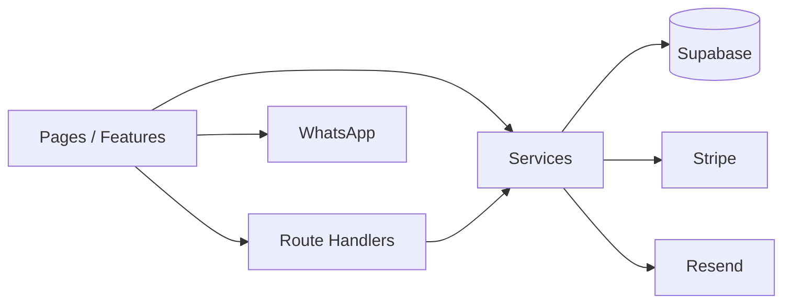

# SUMMARY — Repository Discovery & Architecture Audit

**Project:** Maison Fondjo / `fondjoracine-website`  
**Scope:** Read-only discovery. Documentation set under `docs/repository-discovery/`.  
**No application code was modified.**

---

## Executive Summary

Maison Fondjo is a **Next.js 16 / React 19** production site for a **single product** (Sève Racine). The live customer experience is a **premium bilingual storefront + advisor funnel** that converts primarily through **WhatsApp**. Behind that sits a **full Supabase ecommerce schema**, admin CMS/command center, and implemented (but partially **unmounted**) flows for structured MoMo/Stripe orders, newsletter signup, and DB-backed hair consultations. Legacy multi-product shop routes redirect to the one-product experience while their APIs remain in the codebase.

---

## Architecture Overview

Layered App Router architecture:

```
Browser → src/app (RSC + Route Handlers)
        → src/features (UI compositions)
        → src/services (business operations)
        → src/domain (Zod / types)
        → src/lib (Supabase, Stripe, Resend, …)
```

Documented rules in `docs/ARCHITECTURE.md`: RSC default, lazy SDKs, auth in server code, env via `src/config/env.ts`.



---

## Technology Stack

| Area      | Choice                                                 |
| --------- | ------------------------------------------------------ |
| Framework | Next.js 16.2.9 App Router                              |
| UI        | React 19, Tailwind v4, Radix, Framer Motion, Three/R3F |
| Data      | Supabase Auth + Postgres + RLS                         |
| Payments  | Manual MoMo + optional Stripe                          |
| Email     | Resend                                                 |
| Deploy    | Vercel                                                 |
| Quality   | TypeScript strict, ESLint, Prettier, Husky             |

---

## Frontend Summary

- Server pages compose client islands (`PremiumStorefrontPage`, `AdvisorShell`, admin dashboard).
- Shared UI under `src/components/ui`; features under `src/features/{elixir,commerce,admin,home}`.
- State: Context + local state; no Redux/Zustand/React Query.
- Styling: CSS variables + Tailwind v4; dark luxury theme; Fraunces display font.
- No Server Actions; mutations via `fetch` → API routes.
- Forms: RHF+Zod for complex elixir forms; simpler patterns elsewhere.

---

## Backend Summary

- **29** API Route Handlers; **0** Server Actions; **0** middleware.
- Services concentrate order, CMS admin, consultation, and legacy commerce logic.
- Public sensitive POSTs use rate limits + service-role writes where needed.
- `/api/checkout` is intentionally stubbed toward `/api/elixir/orders`.

---

## Database Summary

Nine migrations define ~40 tables: full ecommerce model plus `storefront_content`, `newsletter_signups`, `inner_circle_members`, `hair_consultations`, and one-product order columns (`confirmation_token`, MoMo fields, extended statuses). RLS + `has_admin_permission` guard admin/customer data. No Storage, Realtime, or Edge Functions in-repo. TypeScript DB types are stubs only.

Details: [10-database.md](./10-database.md), [05-supabase.md](./05-supabase.md).

---

## Authentication Summary

Supabase cookie sessions + `getUser()` + RPC permissions for admin. **No login UI** in repo. Public storefront is unauthenticated. Order confirmation uses opaque tokens. Legacy cart APIs require users but pages redirect away.

Details: [06-authentication.md](./06-authentication.md).

---

## Deployment Summary

Vercel Next.js preset; `npm run build` with prebuild `diagnose`; env from `.env.example`; domain `fondjoracine.com`. Security headers in `next.config.ts`. No custom `vercel.json` beyond framework preset.

Details: [12-deployment.md](./12-deployment.md), [11-environment.md](./11-environment.md).

---

## Business Feature Inventory

| Feature                                | Live UI? | Backend?         |
| -------------------------------------- | -------- | ---------------- |
| Premium EN/FR storefront + CMS read    | Yes      | Yes              |
| WhatsApp ordering                      | Yes      | N/A (external)   |
| Advisor pages + diagnostic quiz        | Yes      | Quiz client-only |
| Admin CMS / MoMo verify / Inner Circle | Yes      | Yes              |
| Order confirmation by token            | Yes      | Yes              |
| Structured elixir checkout (OrderFlow) | **No**   | Yes              |
| Hair consultation agent (DB)           | **No**   | Yes              |
| Newsletter form                        | **No**   | Yes              |
| Stripe webhook                         | N/A      | Yes (gated)      |
| Legacy shop/cart/wishlist pages        | Redirect | APIs retained    |
| Policies / contact                     | Yes      | Static           |

Details: [13-business-features.md](./13-business-features.md), [07-data-flow.md](./07-data-flow.md).

---

## Technical Observations (high level)

- One-product product strategy vs multi-product schema/API surface.
- Orphaned UI for checkout, newsletter, consultation agent.
- Large monolithic feature files; stub DB typing; unused browser Supabase client.
- No middleware; service-role public writes; thin CSP.
- README/env default URL inconsistencies.

Full list: [15-technical-observations.md](./15-technical-observations.md).

---

## Questions or Unknowns

These could not be determined solely from repository files:

1. How admin users are invited/signed in (Supabase Dashboard magic links? external tool?).
2. Which Vercel project/env values are actually set in production (beyond `.env.example`).
3. Whether migrations have been applied 1:1 on the production Supabase project.
4. Whether Cloudinary is used operationally outside this repo.
5. Business intent for remounting OrderFlow vs remaining WhatsApp-only.
6. Presence of private ops runbooks not checked into git.
7. Exact CI (GitHub Actions) if hosted outside this tree — none found here.

---

## Readiness Assessment for Implementing New Features

| Area                                                 | Readiness                                                           |
| ---------------------------------------------------- | ------------------------------------------------------------------- |
| Marketing / advisor page content                     | **High** — patterns clear (`AdvisorShell`, landing pages, CMS)      |
| Admin CMS / ops features                             | **High** — dashboard + permissioned APIs                            |
| Remounting existing checkout/consultation/newsletter | **Medium-High** — backend mostly ready; wire UI carefully           |
| New DB entities                                      | **Medium** — add migration + RLS + service; regenerate/hand types   |
| Auth-gated customer accounts                         | **Low-Medium** — infrastructure exists; **no login UX** yet         |
| Multi-product shop revival                           | **Low** — schema/APIs exist, but product strategy currently one-SKU |

**Guidance for next implementation work:** Prefer extending `src/features/elixir` + `src/services/commerce` + domain Zod schemas; keep env access in `src/config/env.ts`; gate admin with `requireAdminPermission`; treat WhatsApp as the current conversion baseline unless product asks to remount structured checkout.

---

## Document Index

| File                                                           | Topic                           |
| -------------------------------------------------------------- | ------------------------------- |
| [00-overview.md](./00-overview.md)                             | Purpose, users, stack, maturity |
| [01-project-structure.md](./01-project-structure.md)           | Folders & tree                  |
| [02-routing.md](./02-routing.md)                               | Routes inventory                |
| [03-frontend-architecture.md](./03-frontend-architecture.md)   | UI architecture                 |
| [04-backend-architecture.md](./04-backend-architecture.md)     | Services & handlers             |
| [05-supabase.md](./05-supabase.md)                             | Supabase integration            |
| [06-authentication.md](./06-authentication.md)                 | Auth & RBAC                     |
| [07-data-flow.md](./07-data-flow.md)                           | Feature data flows              |
| [08-components.md](./08-components.md)                         | Component catalog               |
| [09-api.md](./09-api.md)                                       | API inventory                   |
| [10-database.md](./10-database.md)                             | Schema / ER                     |
| [11-environment.md](./11-environment.md)                       | Env vars                        |
| [12-deployment.md](./12-deployment.md)                         | Vercel / build                  |
| [13-business-features.md](./13-business-features.md)           | Feature inventory               |
| [14-code-conventions.md](./14-code-conventions.md)             | Conventions                     |
| [15-technical-observations.md](./15-technical-observations.md) | Observations only               |
